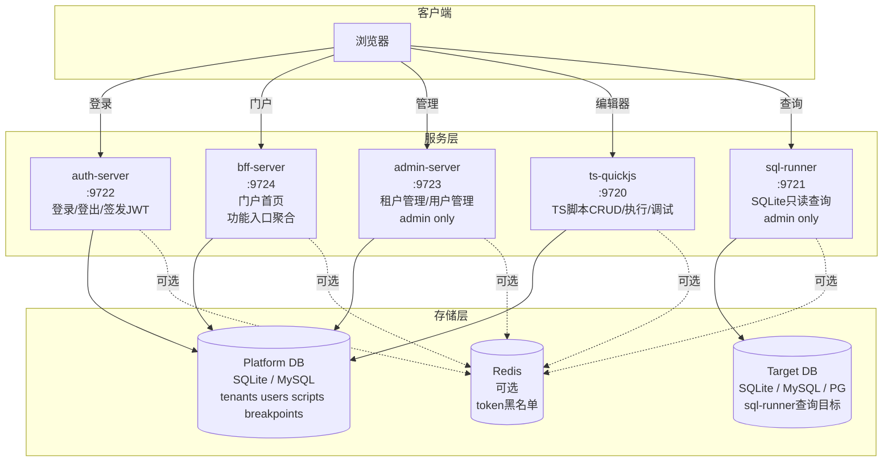
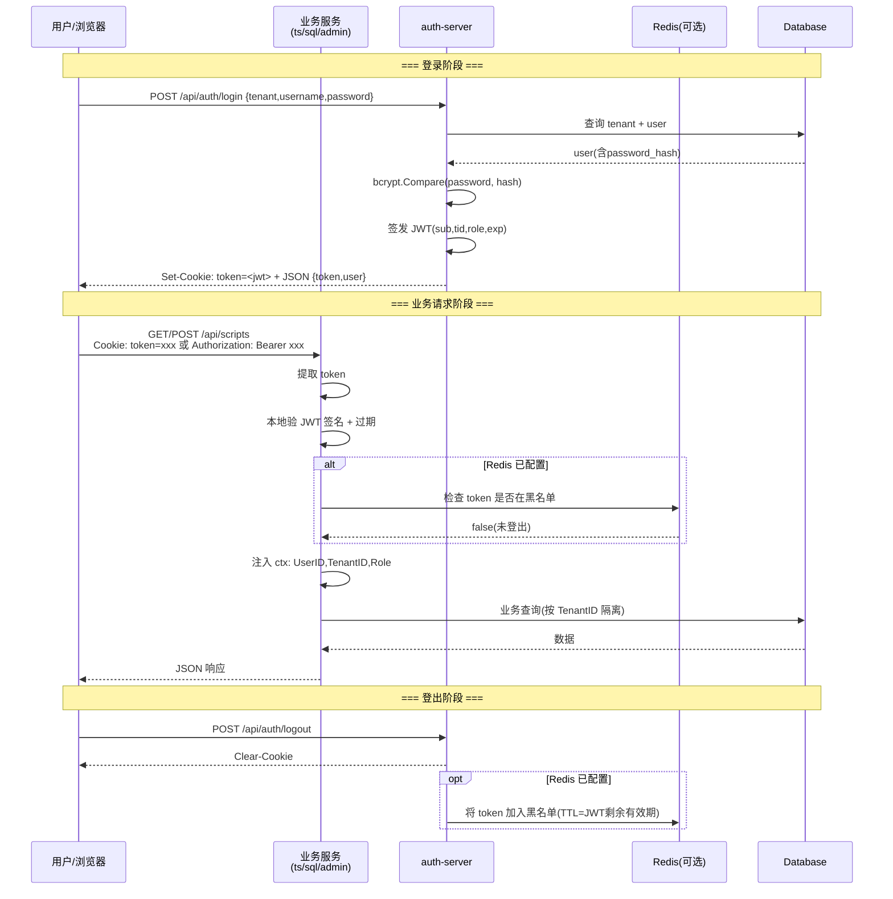
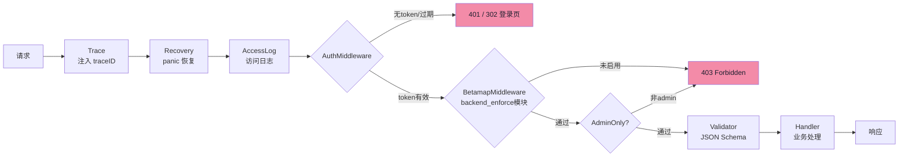
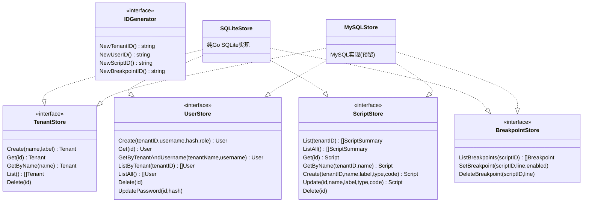
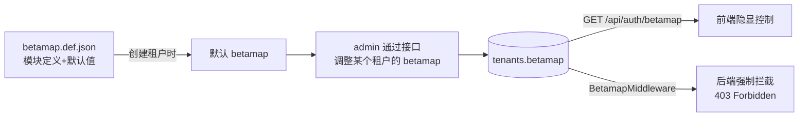
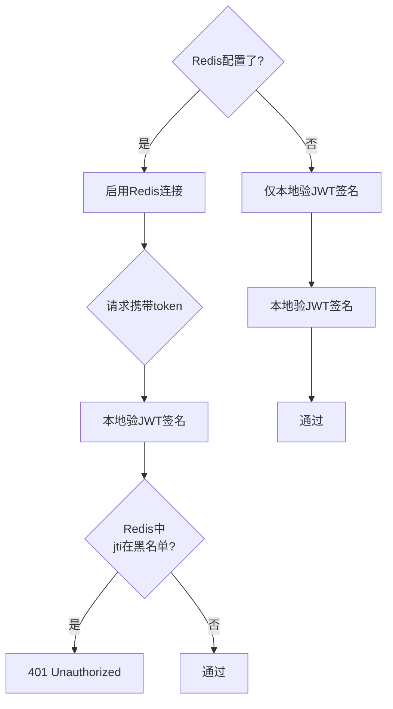
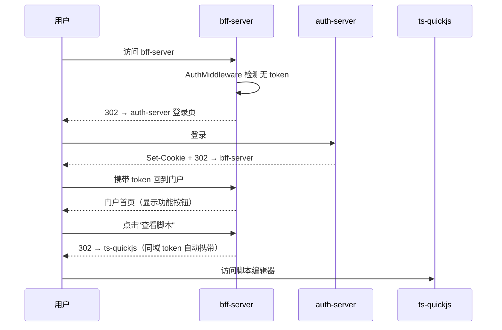
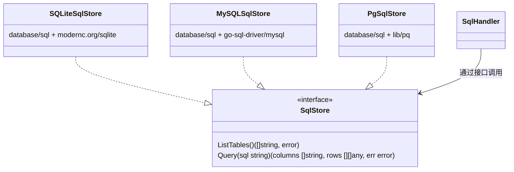

# 多租户账号体系设计文档

> 版本: v1 | 日期: 2026-06-19 | 状态: 待审视

---

## 1. 服务架构

将现有 2 服务拆分为 4 个独立服务，通过共享数据库和共享 JWT 验签协议协作。



---

## 2. 请求链路



---

## 3. 中间件链路



**各服务需要使用哪些中间件：**

| 服务 | auth-server | bff-server | admin-server | ts-quickjs | sql-runner |
|------|-------------|------------|-------------|------------|------------|
| Trace | ✅ | ✅ | ✅ | ✅ | ✅ |
| Recovery | ✅ | ✅ | ✅ | ✅ | ✅ |
| AccessLog | ✅ | ✅ | ✅ | ✅ | ✅ |
| AuthMiddleware | 仅 `/me` | ✅ 全部 | ✅ 全部 | ✅ 全部 | ✅ 全部 |
| BetamapMiddleware | — | 按模块 | — | debug/run 等 | sql 端点 |
| AdminMiddleware | — | — | ✅ 全部 | — | ✅ 全部 |
| Validator | ✅ | — | ✅ | ✅ | ✅ |

### 3.1 BetamapMiddleware 详解

用于对 `backend_enforce: true` 的模块在后端强制拦截。按路由粒度施加。

**签名：**
```go
func BetamapMiddleware(store TenantStore, feature string) func(http.Handler) http.Handler
```

**逻辑：**
```mermaid
flowchart TD
    Start[请求进入] --> GetTID[从 ctx 获取 TenantID]
    GetTID --> FetchTenant[store.Get 查租户]
    FetchTenant --> ParseBetamap[JSON 解析 tenants.betamap]
    ParseBetamap --> Check{modules[feature]<br/>== true ?}
    Check -->|是| Next[放行 → 下一个中间件]
    Check -->|否| Deny[403: feature disabled]
```

**使用示例**（`cmd/ts-quickjs/main.go`）：
```go
// debug 端点：需通过 betamap 的 script_debug 校验
mux.Handle("POST /api/scripts/{id}/debug",
    auth.BetamapMiddleware(database, "script_debug")(
        validator.Middleware(validator.DebugScriptSchema)(
            http.HandlerFunc(h.DebugScript),
        ),
    ),
)
```

**施加规则：** 仅对 `betamap.def.json` 中 `backend_enforce: true` 的模块对应端点施加此中间件。

| 模块 | 对应端点 | 施加服务 |
|------|----------|----------|
| `script_debug` | `POST /api/scripts/{id}/debug` | ts-quickjs |
| `sql_runner` | `GET /api/sql/tables`, `POST /api/sql/run` | sql-runner |
| `admin_panel` | 全部 `/api/admin/*` | admin-server |
| `user_management` | tenant_admin 的用户 CRUD | (将来) |

---

## 4. ID 体系

废弃 Snowflake int64，统一采用**前缀 + 时间戳 + 随机数**的 20 位 hex 字符串 ID。

### 4.1 格式

```
┌──────────┬──────────────────┬──────────────┐
│ Prefix   │  Timestamp(ms)   │   Random     │
│  4 chars │    12 chars      │   4 chars    │
│  hex     │    hex           │   hex        │
└──────────┴──────────────────┴──────────────┘
  001a       019b8f3c1000       a1b2

示例: 001a019b8f3c1000a1b2  (tenants 表的一条记录)
```

### 4.2 表前缀定义

| 表 | Prefix | 含义 |
|----|--------|------|
| tenants | `001a` | KeyPrefixTenant |
| users | `001b` | KeyPrefixUser |
| scripts | `001c` | KeyPrefixScript |
| breakpoints | `001d` | KeyPrefixBreakpoint |

### 4.3 生成逻辑

```mermaid
flowchart LR
    Time[time.Now().UnixMilli] --> TimeHex[fmt.Sprintf('%012x', ms)]
    Rand[crypto/rand 2字节] --> RandHex[fmt.Sprintf('%04x', r)]
    Prefix[表前缀] --> ID[Prefix + TimeHex + RandHex]
    TimeHex --> ID
    RandHex --> ID
```

**特点：**
- 全球唯一、无中心化依赖
- 天然字典序递增 = 按创建时间排序
- 看 ID 前缀即可判断所属表
- 无需 Snowflake 节点 ID 配置

---

## 5. 数据库设计

### 5.1 接口抽象



### 5.2 新增表 DDL

```sql
-- 租户表
CREATE TABLE tenants (
    id         TEXT PRIMARY KEY,              -- 001a019b8f...
    name       TEXT NOT NULL UNIQUE,           -- 租户标识(用于登录)
    label      TEXT NOT NULL DEFAULT '',        -- 显示名称
    betamap    TEXT NOT NULL DEFAULT '{}',      -- 功能开关 JSON
    created_at DATETIME DEFAULT CURRENT_TIMESTAMP,
    updated_at DATETIME DEFAULT CURRENT_TIMESTAMP
);

-- 用户表
CREATE TABLE users (
    id            TEXT PRIMARY KEY,            -- 001b019b8f...
    tenant_id     TEXT NOT NULL,               -- FK → tenants.id
    username      TEXT NOT NULL,                -- 用户名
    password_hash TEXT NOT NULL,                -- bcrypt哈希
    role          TEXT NOT NULL DEFAULT 'user', -- admin / user
    created_at    DATETIME DEFAULT CURRENT_TIMESTAMP,
    updated_at    DATETIME DEFAULT CURRENT_TIMESTAMP,
    UNIQUE(tenant_id, username),
    FOREIGN KEY (tenant_id) REFERENCES tenants(id)
);
```

### 5.3 现有表改造

```sql
-- scripts 表：ID改为TEXT，新增tenant_id隔离列
ALTER TABLE scripts RENAME TO scripts_old;
CREATE TABLE scripts (
    id         TEXT PRIMARY KEY,
    tenant_id  TEXT NOT NULL DEFAULT '',
    name       TEXT NOT NULL,
    label      TEXT NOT NULL,
    type       TEXT NOT NULL DEFAULT '',
    ts_code    TEXT NOT NULL DEFAULT '',
    created_at DATETIME DEFAULT CURRENT_TIMESTAMP,
    updated_at DATETIME DEFAULT CURRENT_TIMESTAMP,
    UNIQUE(tenant_id, name),
    FOREIGN KEY (tenant_id) REFERENCES tenants(id)
);
-- 迁移存量数据...（旧数据归入默认admin租户）

-- breakpoints 表：script_id改为TEXT
ALTER TABLE breakpoints RENAME TO breakpoints_old;
CREATE TABLE breakpoints (
    script_id TEXT NOT NULL,
    line      INTEGER NOT NULL,
    enabled   INTEGER NOT NULL DEFAULT 1,
    PRIMARY KEY (script_id, line),
    FOREIGN KEY (script_id) REFERENCES scripts(id) ON DELETE CASCADE
);
```

### 5.4 Betamap 功能开关

每个租户拥有一个 **betamap**（JSON），控制该租户用户在前端可见的功能模块。

#### 5.4.1 Betamap 定义文件

`betamap.def.json` 定义所有可用模块、默认值及是否需后端拦截：

```json
{
    "modules": {
        "script_editor":  {"default": true,  "label": "脚本编辑器", "backend_enforce": false},
        "script_run":     {"default": true,  "label": "脚本执行",   "backend_enforce": false},
        "script_debug":   {"default": false, "label": "断点调试",   "backend_enforce": true},
        "sql_runner":     {"default": false, "label": "SQL查询工具", "backend_enforce": true},
        "admin_panel":    {"default": false, "label": "管理面板",   "backend_enforce": true},
        "user_management": {"default": false, "label": "用户管理",   "backend_enforce": true}
    }
}
```

| 字段 | 说明 |
|------|------|
| `default` | 创建租户时的初始值 |
| `label` | 前端展示名称 |
| `backend_enforce` | `true` = 后端中间件强制拦截，不依赖前端隐藏 |

admin 可为每个租户定制 betamap，覆盖默认值。存储在 tenants 表的 `betamap` 字段（TEXT/JSON）。



#### 5.4.3 Betamap 流转

1. **定义**：`betamap.def.json` 随代码仓库发布，定义全平台可用模块及默认值
2. **创建租户**：admin 创建租户时自动生成一份默认 betamap，或 admin 指定
3. **调整**：admin 通过 `PUT /api/admin/tenants/{id}/betamap` 修改某个租户的开关
4. **前端获取**：前端登录后通过 `GET /api/auth/betamap` 拉取当前租户的 betamap，控制 UI 显隐
5. **后端拦截**：对于 `backend_enforce: true` 的模块，BetamapMiddleware 读取 tenants.betamap 并校验，不通过返回 `403 Forbidden`

### 5.5 租户主账号

每个租户自动拥有一个**主账号**，用于租户内部管理：

| 属性 | 值 |
|------|-----|
| username | 与租户 `name` 相同 |
| password | 与租户 `name` 相同（首次登录建议修改）|
| role | `tenant_admin` |

创建租户时自动创建该主账号。`tenant_admin` 角色拥有该租户内的管理权限（如管理本租户用户），但不能跨租户操作。

**角色体系：**

| Role | 权限范围 |
|------|----------|
| `admin` | 平台级：所有租户、所有用户、betamap 管理 |
| `tenant_admin` | 租户级：本租户内用户管理、脚本管理 |
| `user` | 租户级：本租户内脚本 CRUD（受 betamap 约束）|

### 5.6 内置种子数据

系统启动时自动检查并插入（如果不存在）：

| 表 | 字段 | 值 |
|----|------|-----|
| tenants | id | 按前缀规则生成 |
| tenants | name | `admin` |
| tenants | label | `默认管理租户` |
| tenants | betamap | 从 `betamap.def.json` 生成（全部模块启用） |
| users | tenant_id | 上述 admin 租户的 ID |
| users | username | `admin` |
| users | password_hash | `bcrypt("admin123")` |
| users | role | `admin` |

### 5.7 数据库后端切换

通过 `config.json` 的 `db_driver` 字段控制：

```json
// SQLite（默认，零依赖本地开发）
{
    "db_driver": "sqlite",
    "sqlite_path": "scripts.db"
}

// MySQL（生产环境或容器化本地开发）
{
    "db_driver": "mysql",
    "mysql_dsn": "toy:pass@tcp(127.0.0.1:3306)/toy_platform?parseTime=true"
}
```

工厂方法 `db.NewStore(cfg)` 自动根据 `db_driver` 返回对应实现。

### 5.8 本地开发容器化

本地不安装 MySQL/Redis，通过 Docker Compose 运行开发依赖：

**`docker-compose.dev.yml`**（仅开发依赖，不含服务本身）：

```yaml
services:
  mysql:
    image: mysql:8.0
    environment:
      MYSQL_ROOT_PASSWORD: root123
      MYSQL_DATABASE: toy_platform
      MYSQL_USER: toy
      MYSQL_PASSWORD: toy123
    ports:
      - "3306:3306"
    volumes:
      - mysql_data:/var/lib/mysql

  redis:
    image: redis:7-alpine
    ports:
      - "6379:6379"
    volumes:
      - redis_data:/data

volumes:
  mysql_data:
  redis_data:
```

**开发时对应 config.json：**

```json
{
    "db_driver": "mysql",
    "mysql_dsn": "toy:toy123@tcp(127.0.0.1:3306)/toy_platform?parseTime=true",
    "redis_addr": "127.0.0.1:6379"
}
```

启动依赖：`docker compose -f docker-compose.dev.yml up -d`。不使用 MySQL 时保持 `db_driver: "sqlite"` 即可零依赖开发。

---

## 6. Token 认证

### 6.1 JWT 结构

```
Header:  {"alg": "HS256", "typ": "JWT"}
Payload: {
    "sub":  "001b...",      // 用户ID
    "tid":  "001a...",      // 租户ID
    "tn":   "admin",         // 租户name(可选,减少DB查询)
    "role": "admin|tenant_admin|user",
    "exp":  1735228800,      // 过期时间(默认1h)
    "iat":  1735225200,      // 签发时间
    "jti":  "unique-jti"     // JWT ID(用于黑名单)
}
```

### 6.2 Token 传递方式（同时支持两种，Header 优先）

| 方式 | 格式 | 适用场景 |
|------|------|----------|
| Authorization Header | `Bearer <token>` | API 调用、前端 fetch 拦截器 |
| Cookie | `token=<token>; HttpOnly; SameSite=Lax` | 浏览器自动携带 |

### 6.3 Redis 黑名单（可选）



**使用 go-redis 客户端**，只在配置中有 `redis_addr` 时才初始化连接。

**黑名单策略：**
- 登出时将 `jti` 写入 Redis，TTL = token 剩余有效期
- 改密/踢人时将用户所有活跃 token 的 jti 批量写入黑名单
- 未配置 Redis 时降级：登出仅清除前端 Cookie（token 有效期内仍可用）

### 6.4 配置项

```json
{
    "jwt_secret": "",
    "token_expire_hours": 1,

    "redis_addr": "",
    "redis_password": "",
    "redis_db": 0
}
```

| 字段 | 说明 | 本地开发值 |
|------|------|-----------|
| `redis_addr` | 空 = 不启用 Redis 黑名单 | `"127.0.0.1:6379"` (启用容器后) |
| `redis_password` | Redis 密码 | `""` (开发环境无需) |
| `redis_db` | Redis DB 编号 | `0` |

`jwt_secret` 为空时，首次启动自动生成 32 字节随机密钥并持久化到配置文件。

---

## 7. API 接口

### 7.1 auth-server (:9722)

| 方法 | 路径 | 鉴权 | Body | 响应 |
|------|------|------|------|------|
| POST | `/api/auth/login` | 无 | `{tenant, username, password}` | `{token, user}` |
| POST | `/api/auth/logout` | 无 | — | Clear-Cookie |
| GET | `/api/auth/me` | 需 token | — | `{id, username, role, tenantId, tenantName}` |
| GET | `/api/auth/betamap` | 需 token | — | 当前租户的 betamap JSON |
| POST | `/api/auth/refresh` | 需 token | — | 新 token（续期） |

### 7.2 bff-server (:9724)

门户首页，用户登录后的统一入口。所有接口需 token。

**页面路由：**

| 方法 | 路径 | 说明 |
|------|------|------|
| GET | `/` | 301 → `/bff/ui/index.html` |
| GET | `/bff/ui/index.html` | 门户首页 |

**API 接口：**

| 方法 | 路径 | 鉴权 | 响应 |
|------|------|------|------|
| GET | `/api/bff/entries` | 需 token | 当前租户可用的功能入口列表（按 betamap 过滤） |

**`GET /api/bff/entries` 响应示例：**

```json
[
    {"id": "scripts",    "label": "查看脚本",  "url": "http://127.0.0.1:9720/ts-quickjs/ui/index.html", "enabled": true},
    {"id": "sql_runner", "label": "SQL查询",   "url": "http://127.0.0.1:9721/sql-runner/ui/index.html", "enabled": false},
    {"id": "admin",      "label": "管理面板",   "url": "http://127.0.0.1:9723/admin/ui/index.html",     "enabled": false}
]
```

> `enabled` 由当前租户的 betamap 决定。前端据此渲染按钮。

**登录跳转流程：**



### 7.3 admin-server (:9723)

所有接口需 token + admin role。

| 方法 | 路径 | Body | 响应 |
|------|------|------|------|
| GET | `/api/admin/tenants` | — | `[{id, name, label, createdAt}]` |
| POST | `/api/admin/tenants` | `{name, label}` | 新创建的 Tenant |
| GET | `/api/admin/tenants/{id}/users` | — | `[{id, username, role, createdAt}]` |
| POST | `/api/admin/tenants/{id}/users` | `{username, password, role}` | 新创建的 User |
| DELETE | `/api/admin/tenants/{id}/users/{uid}` | — | 204 |

**Backdoor 接口（admin-only，跨租户查看）：**

| 方法 | 路径 | Body | 响应 |
|------|------|------|------|
| GET | `/api/admin/users` | — | 所有租户所有用户列表（含 password_hash） |
| PUT | `/api/admin/users/{uid}/password` | `{password}` | 204 重置任意用户密码 |

**Betamap 管理接口（admin-only）：**

| 方法 | 路径 | Body | 响应 |
|------|------|------|------|
| GET | `/api/admin/tenants/{id}/betamap` | — | 该租户当前的 betamap JSON |
| PUT | `/api/admin/tenants/{id}/betamap` | JSON 对象 | 更新后的 betamap |
| GET | `/api/admin/betamap/def` | — | `betamap.def.json` 定义文件内容 |

> **安全说明：** bcrypt 哈希是单向的，admin 只能看到哈希值而无法反推明文密码。`password_hash` 字段在返回中保留主要供开发阶段审计，生产环境可通过配置关闭该字段的暴露。密码重置是实际可行的管理手段。

### 7.4 ts-quickjs (:9720)

现有脚本 CRUD 接口保持不变，内部加入租户隔离逻辑：

- 普通用户：`WHERE tenant_id = ctx.TenantID`
- admin 用户：不添加 WHERE 条件（可查看全部）或通过 `?all=true` 参数

### 7.5 sql-runner (:9721)

所有接口需 token + admin role。**不操作平台自身的 scripts.db**，而是连接管理员指定的目标数据库执行只读查询。

**支持数据库类型：**

| 驱动 | 配置中 driver 值 | 状态 |
|------|-----------------|------|
| SQLite | `sqlite3` | Phase 1 实现 |
| MySQL | `mysql` | Phase 1 实现 |
| PostgreSQL | `postgres` | Phase 2 实现 |

**配置示例**（`cmd/sql-runner/conf/config.json`）：

```json
{
    "db_driver": "mysql",
    "sqlite_path": "target.db",
    "mysql_dsn": "user:pass@tcp(host:3306)/dbname",
    "postgres_dsn": "user:pass@host:5432/dbname"
}
```

**数据模型：**



**现有接口不变：**

| 方法 | 路径 | 说明 |
|------|------|------|
| GET | `/api/sql/tables` | 列出目标库所有表 |
| POST | `/api/sql/run` | 执行 SELECT/EXPLAIN/WITH 查询 |

安全规则：无论连接哪种数据库，仅允许 SELECT/EXPLAIN/WITH 语句，拒绝 INSERT/UPDATE/DELETE/DROP/ALTER/PRAGMA 等写操作。

---

## 8. 目录结构

```
ToyLowcodePlatform/
│
├── betamap.def.json                     # [新增] 全平台功能模块定义 + 默认值
│
├── cmd/
│   ├── auth-server/                     # [新增] 认证服务 :9722
│   │   ├── main.go                      #   入口：路由注册 + 中间件链
│   │   ├── conf/
│   │   │   └── config.json.sample       #   配置模板
│   │   └── static/
│   │       └── login.html               #   登录页 (独立SPA)
│   │
│   ├── bff-server/                      # [新增] 门户服务 :9724
│   │   ├── main.go                      #   入口：AuthMiddleware + 功能入口路由
│   │   ├── conf/
│   │   │   └── config.json.sample
│   │   └── static/
│   │       └── index.html               #   门户首页（功能按钮聚合）
│   │
│   ├── admin-server/                    # [新增] 管理服务 :9723
│   │   ├── main.go                      #   入口：admin 路由 + Admin中间件
│   │   └── conf/
│   │       └── config.json.sample
│   │
│   ├── ts-quickjs/                      # [修改] TS脚本服务 :9720
│   │   ├── main.go                      #   接入 AuthMiddleware + 租户隔离
│   │   ├── conf/
│   │   │   └── config.json.sample
│   │   └── static/
│   │       └── index.html               #   编辑器SPA (加登录检测跳转)
│   │
│   └── sql-runner/                      # [修改] SQL查询服务 :9721
│       ├── main.go                      #   接入 AuthMiddleware + AdminMiddleware
│       │                                #   使用 sqlstore 工厂连接目标数据库
│       ├── conf/
│       │   └── config.json.sample
│       └── static/
│           └── index.html
│
├── core/
│   ├── idgen/                           # [新增] 前缀ID生成器
│   │   ├── idgen.go                     #   20位 hex ID: prefix(4) + time(12) + rand(4)
│   │   └── idgen_test.go
│   │
│   ├── auth/                            # [新增] 认证模块 (所有服务共享)
│   │   ├── auth.go                      #   JWT 签发/验证/crypto/rand + bcrypt 哈希
│   │   ├── middleware.go                #   AuthMiddleware (token提取+验签+注入ctx)
│   │   │                                #   AdminMiddleware (检查 admin role)
│   │   │                                #   BetamapMiddleware (检查租户功能开关)
│   │   ├── redis.go                     #   Redis token黑名单 (可选,配置驱动)
│   │   └── auth_test.go
│   │
│   ├── db/                              # [重构] 平台数据层 (接口化)
│   │   ├── interfaces.go                #   IDGenerator / TenantStore / UserStore
│   │   │                                #   / ScriptStore / BreakpointStore 接口定义
│   │   ├── factory.go                   #   NewStore(cfg) 根据 db_driver 返回实现
│   │   ├── sqlite/
│   │   │   ├── sqlite.go                #   SQLite实现: 建表/迁移/种子数据/CRUD
│   │   │   └── sqlite_test.go
│   │   └── mysql/
│   │       └── mysql.go                 #   MySQL实现 (Phase 2)
│   │
│   ├── handler/                         # [修改+新增] HTTP处理器
│   │   ├── handler.go                   #   脚本 CRUD + Run/Debug (加租户隔离逻辑)
│   │   ├── handler_test.go
│   │   ├── authhandler.go               #   login / logout / me / betamap
│   │   ├── adminhandler.go              #   tenant CRUD / user CRUD / betamap管理 / backdoor
│   │   ├── sqlhandler.go                #   SQL handler (改用 SqlStore 接口)
│   │   └── sqlhandler_test.go
│   │
│   ├── sqlstore/                        # [新增] SQL查询目标库抽象 (sql-runner专用)
│   │   ├── store.go                     #   SqlStore接口 + SQLite/MySQL/PG三种驱动实现
│   │   └── factory.go                   #   NewSqlStore(cfg) 工厂
│   │
│   ├── validator/                       # [已有] JSON Schema 校验中间件
│   │   ├── validator.go
│   │   ├── schemas.go
│   │   └── validator_test.go
│   │
│   ├── logger/                          # [已有] slog 日志 + 中间件
│   │   └── logger.go
│   │
│   ├── config/                          # [修改] 配置加载
│   │   ├── config.go                    #   新增 jwt_secret / redis / db_driver 字段
│   │   └── config_test.go
│   │
│   └── runtime/                         # [已有] JS运行时 (QuickJS/Goja)
│       ├── types.go
│       ├── runtime.go
│       ├── goja_runner.go
│       ├── common.go
│       └── ast_scope.go
│
├── docker-compose.dev.yml               # [新增] 本地开发依赖 (MySQL + Redis)
├── docker-compose.yml                   # [修改] 4服务编排
├── Makefile                             # [修改] 新增 auth/admin 构建目标
├── go.mod
├── go.sum
│
├── docs/
│   ├── account-system-design.md         # 本文档
│   ├── debugger-design.md
│   ├── debug-ui-stepping.md
│   ├── sourcemap-design.md
│   ├── frontend-editor.md
│   └── bugfix-001-quickjs-commonjs-module.md
│
└── README.md                            # [修改] 更新服务说明
```

### 8.1 各文件职责说明

| 文件/目录 | 状态 | 职责 |
|-----------|------|------|
| `betamap.def.json` | 新增 | 平台全局功能模块定义，admin 创建租户时根据此生成默认 betamap |
| `cmd/auth-server/` | 新增 | 独立认证服务，处理 login/logout/me/betamap，签发 JWT |
| `cmd/bff-server/` | 新增 | 门户首页，聚合功能入口，按 betamap 渲染可用按钮，未登录 302 到登录页 |
| `cmd/admin-server/` | 新增 | 独立管理服务，tenant/user CRUD + betamap 管理 + backdoor，仅 admin 可访问 |
| `cmd/ts-quickjs/` | 修改 | 现有 TS 脚本服务，接入 AuthMiddleware，handler 加入租户隔离 |
| `cmd/sql-runner/` | 修改 | 现有 SQL 查询服务，接入 AuthMiddleware + AdminMiddleware，使用 sqlstore 连接外部数据库 |
| `core/idgen/` | 新增 | 前缀 ID 生成，替代 Snowflake，所有表统一使用 |
| `core/auth/` | 新增 | 认证核心：JWT 签发/验证、bcrypt、AuthMiddleware、AdminMiddleware、Redis 黑名单 |
| `core/db/` | 重构 | 数据层接口化：定义 Store 接口 → SQLite/MySQL 两种实现 → 工厂创建 |
| `core/handler/` | 修改 | 新增 authhandler/adminhandler；handler.go 加租户隔离；sqlhandler.go 改用接口 |
| `core/sqlstore/` | 新增 | sql-runner 专用：目标数据库连接抽象，支持 SQLite/MySQL/PG，与 core/db 完全独立 |
| `core/config/` | 修改 | 扩展 jwt_secret / redis / db_driver 等配置字段 |
| `core/validator/` | 已有 | JSON Schema 校验中间件，集成到各服务 |
| `core/logger/` | 已有 | 日志 + Trace/Access/Recovery 中间件 |
| `core/runtime/` | 已有 | JS 运行时引擎（QuickJS/Goja/esbuild 编译管线）|
| `docker-compose.dev.yml` | 新增 | 本地开发依赖：MySQL 8.0 + Redis 7 容器 |
| `docker-compose.yml` | 修改 | 4 服务完整编排 |
| `Makefile` | 修改 | 新增 `make run-auth` / `make run-admin` 等目标 |

---

## 9. 实施计划

| 阶段 | 内容 | 影响范围 |
|------|------|----------|
| **Phase 1** | `core/idgen/` 前缀ID生成器 | 新增 |
| **Phase 2** | `core/db/` 接口化 + SQLite实现 + 建表/迁移 | 重构既有 db 层 |
| **Phase 3** | `core/auth/` JWT + bcrypt + 中间件 + Redis | 新增 |
| **Phase 4** | auth-server + login.html | 新增服务 |
| **Phase 5** | admin-server | 新增服务 |
| **Phase 6** | ts-quickjs + sql-runner 接入认证 + 租户隔离 | 修改既有服务 |
| **Phase 7** | MySQL 实现 | 预留接口实现 |
| **Phase 8** | Makefile + docker-compose 更新 | 构建/部署 |

---

## 10. 待确认事项

| # | 问题 | 当前方案 |
|---|------|----------|
| 1 | 存量数据迁移策略 | 旧 Snowflake ID scripts 迁移到新 ID + 归入 admin 租户 |
| 2 | admin 首次登录是否强制改密 | 暂不强制，仅文档提示 |
| 3 | 是否需要用户注册功能 | 当前版本仅 admin 创建用户 |
| 4 | 登录页是独立页面还是编辑器内弹窗 | 独立 login.html 页面，未登录 302 跳转 |
| 5 | MySQL 是否 Phase 1 就实现 | 先接口化 + SQLite实现，MySQL暂留接口框架 |

---

> 下一步：审阅后进入 Phase 1 实现。
